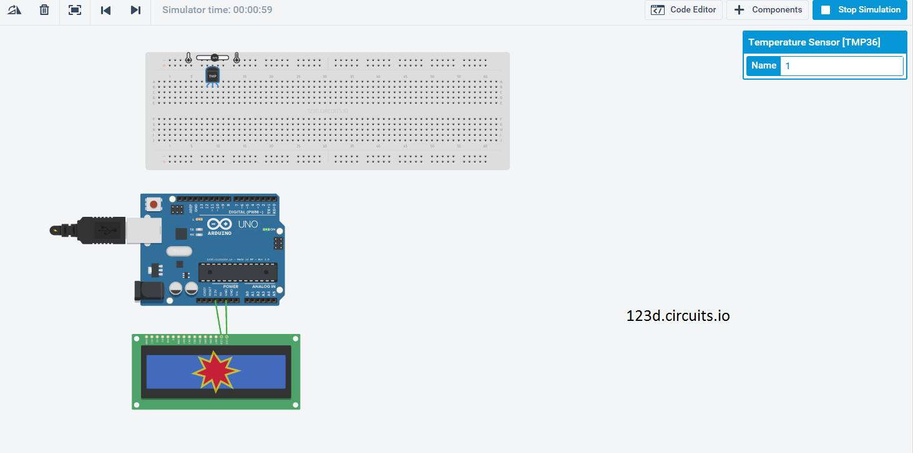
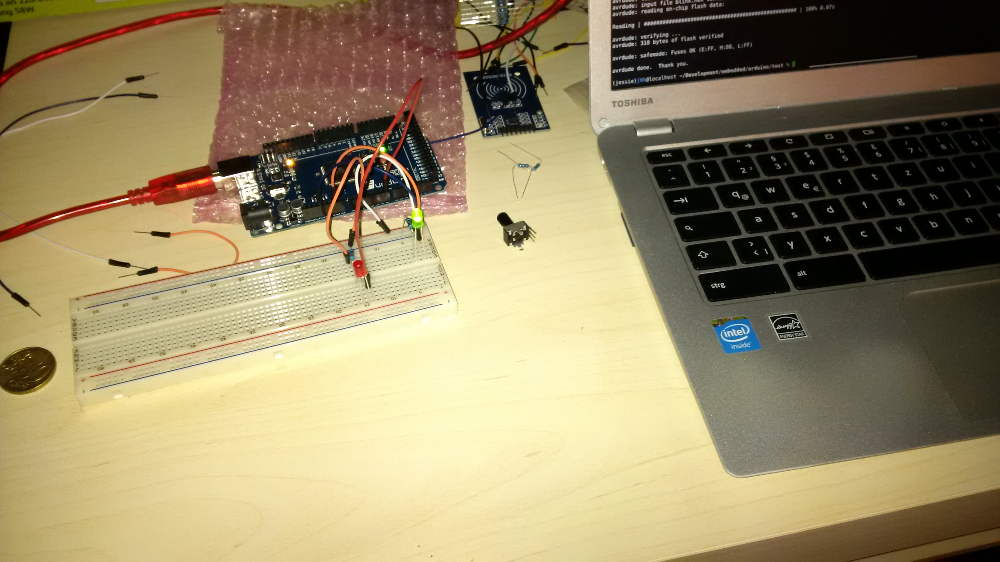
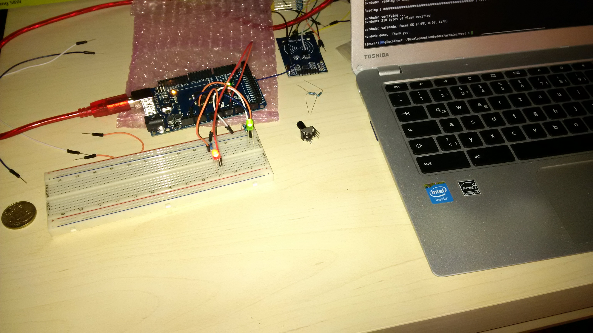

% Ada Exercise 4
% Christian Tabe <christian.tabe@rwth-aachen.de>
  Andreas Wüstenberg <andreas.wuestenberg@rwth-aachen.de>
  Johannes Neuhaus <johannes.neuhaus@rwth-aachen.de>


---
geometry: margin=1in
---

# Task 4.1

   `BinTree/Bintree_adt.adb`


# Task 4.2

## Task 1

   hopefully done. Maybe...

## Task 2

   Several entities will be needed and concurrency is a big deal.
   As shortly described in Task 3, the driver layer should somehow
   compile using C drivers. This will need more testing and a more
   sophisticated `Makefile`. Probably a look into the sources of the
   Ada Crosscompiler helps as they must somehow support the `<avr/*>`
   inludes.  

   We suppose the following set of entities/tasks and a layered software 
   stack (much ASCII art).


```
    --------------
    | Node.JS    |
    | Webserver/ |     consuming data
    | Coordinator|<----------------------\
    --------------                        \
            |                              \
            | optional layer - TCP socket   \
---------------------------               --------------
------\                                   | SQL Server |
|logic|                                   |            | 
|     |                                   --------------
-------                                    ^
   ------------------  ------------------- | Writes Errors/Heatings/Warnings
   | Ada Dispatcher |--| Ada             |/  into the database - necessary
   | Tasks          |  | Data Management |   when tracking errors or providing
   ------------------  -------------------   a heating history (which is probably
                                             a good idea


---------------------------
```


## Task 3
    
    
    
  
  Idea: Crosscompile hardware driver layer with C and use it with Ada. This will
  complicated as hell but writing drivers in Ada will probably take to much time.
  We provide a first Makefile for usage in linux systems which cross compiles 
  a C program and is able to install it on an arduino. It might be enough to
  compile the C files to their corresponding object files, which then can be 
  hopefully used by the Ada cross compiler. We are confident that this will work.
  Ada and C should gracefully interact - gcc itself is a certified Ada compiler.


# Task 4.3

1) c.

2) c.

3) a.

4) d. bzw. e., falls generic nicht darüber steht

5) b.

6) b.

7) a.

8) c.

9) b.

11) c.

12)   
    a. -> Does not work.  Type mismatch (and syntax error).  
    b. -> Does not work.  Type mismatch (and syntax error).  
    c. -> Works.  C is set to (F,W,W,F).  
    d. -> Works.  D is set to (F,W,W,F).  
    e. -> Does not work. Constraint error.    
    f. -> Does not work. Type mismatch (and syntax error).  
